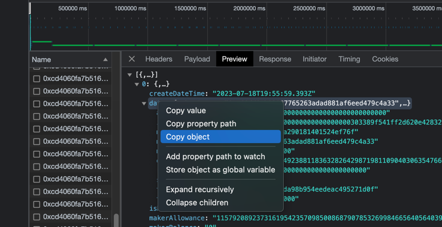
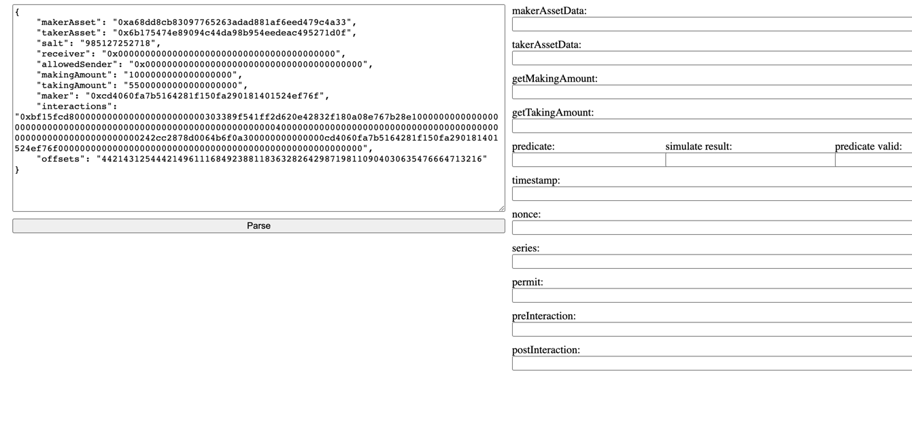

# 1inch limit order parser

## How to use:
1. clone repo 
```
git@github.com:1inch/limit-order-parser.git
```
2. install deps:
```
cd limit-order-parser
yarn
```
3. run parser:
```
yarn start
```

open the dApp and copy limit order from the network bookmark. Order should look like(data from the Backend answer):

```
{
    "makerAsset": "0xa68dd8cb83097765263adad881af6eed479c4a33",
    "takerAsset": "0x6b175474e89094c44da98b954eedeac495271d0f",
    "salt": "985127252718",
    "receiver": "0x0000000000000000000000000000000000000000",
    "allowedSender": "0x0000000000000000000000000000000000000000",
    "makingAmount": "1000000000000000000",
    "takingAmount": "55000000000000000000",
    "maker": "0xcd4060fa7b5164281f150fa290181401524ef76f",
    "interactions": "0xbf15fcd8000000000000000000000000303389f541ff2d620e42832f180a08e767b28e10000000000000000000000000000000000000000000000000000000000000004000000000000000000000000000000000000000000000000000000000000000242cc2878d0064b6f0a300000000000000cd4060fa7b5164281f150fa290181401524ef76f00000000000000000000000000000000000000000000000000000000",
    "offsets": "4421431254442149611168492388118363282642987198110904030635476664713216"
}
```
paste it to the parser and click parse button:


